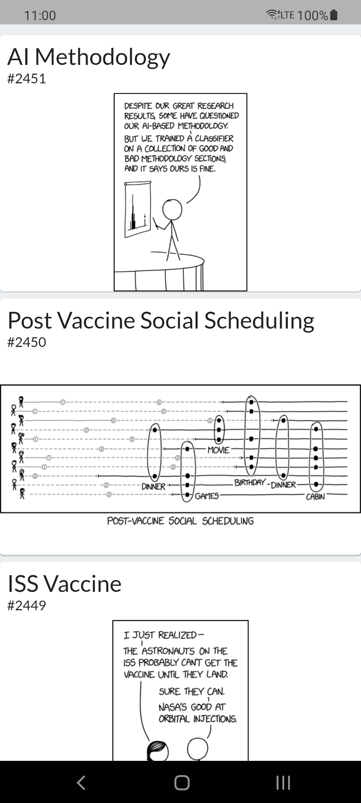
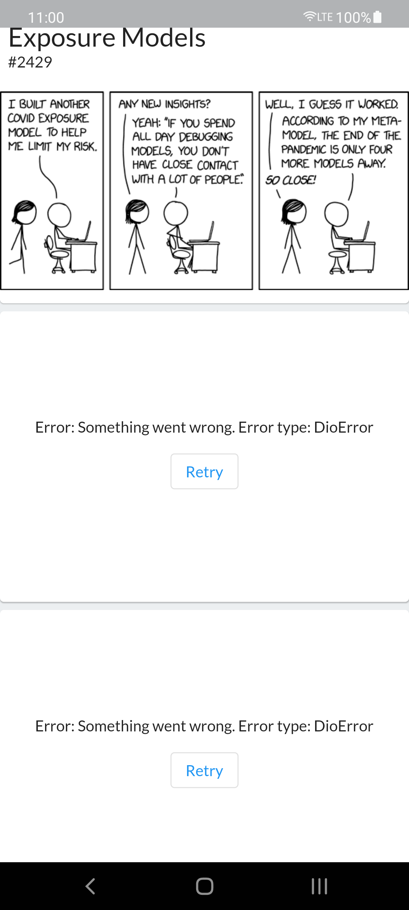
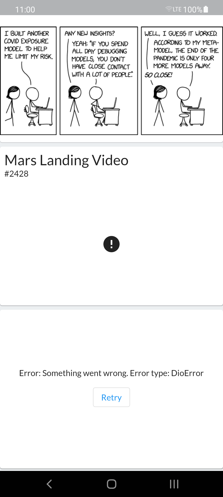

# xkcd_comics_viewer

## Description
This Flutter app shows the list of [xkcd comics](https://xkcd.com/).
The API is not a typical paginated REST service. You can get the latest comic via the [https://xkcd.com/info.0.json](https://xkcd.com/info.0.json ) URL. The
response will contain the ID of the latest comic. To get previous comics, you need to call https://xkcd.com/{comic_id}/info.0.json, where `{comic_id}` is the ID
 of the comic, lower then the latest comic (for example information about comic #614 will be in [https://xkcd.com/614/info.0.json](https://xkcd.com/614/info.0
.json)). As you can see, this is not a typical paginated API, so my approach is a bit different then the usual one, when you load 10 next items when you scroll
close to the end of the list.

The HomeScreen contains a MobX ComicStore, that loads the latest comic via the GetLatestComic use case. If the response is successful, a lazy list of comics is
created, by using a `ListView.builder` approach. Each item in that list (comic tile) has its own independent ComicStore, that tries to load the comic information.
If that response is successful, that single comic is presented to the user with it's title and ID.

Error cases that are supported:
| Error case  | UX solution |
|---|---|
| error while opening the app (AKA downloading the latest comic in HomeScreen)  |  Retry button |
| error while downloading a single comic with a specific ID (AKA error while scrolling through the app) |  Retry button |
| error while loading the comic image  |  reload on scroll (the UI of a single comic needs to reload) |

## Screenshots and gifs
|Scenario|Screenshot|gif|
|-|-|-|
|Normal usage||||
|Error while scrolling through the app|||![Error while scrolling gif]
(demo/gifs/xkcd_error_while_scrolling.gif)|
|Error while opening the app|||![Error while opening gif]
(demo/gifs/xkcd_error_while_opening.gif)|
|Error while loading the comic image||||

## Dependencies
| Type  | Dependency name |
|---|---|
| State management  |  [mobx](https://pub.dev/packages/mobx) |
| Dependency injection | [get_it](https://pub.dev/packages/get_it)  |
| Local database  | [hive](https://pub.dev/packages/hive)  |
| Rest client  |  [retrofit](https://pub.dev/packages/retrofit) |
| Image loading  |  [cached_network_image](https://pub.dev/packages/cached_network_image) |
| Image interactive view  | [photo_view](https://pub.dev/packages/photo_view)  |
| Internationalization  | [easy_localization](https://pub.dev/packages/easy_localization)  |

## Getting Started

### 1. Get dependencies
`flutter pub get`

### 2. Prepare all the generated files:
Generate REST client, test mocks, MobX stores, Hive classes:
`flutter pub run build_runner build watch --delete-conflicting-outputs`

Generate easy_localization translations
`flutter pub run easy_localization:generate --source-dir ./assets/translations`

Generate easy_localization keys
`flutter pub run easy_localization:generate --source-dir ./assets/translations -f keys -o locale_keys.g.dart`

### 3. Run unit, widget tests
`flutter test`

### 4. Run the app
Debug mode:
`flutter run --debug`

Release mode (not working on emulators, at least the Android ones):
`flutter run --release`

### Plans for the future:
- [ ] Add integration tests (flutter_driver needs to be updated to null-safety). More info: https://flutter.dev/docs/null-safety
- [ ] Add dark mode
- [ ] Add favourite feature